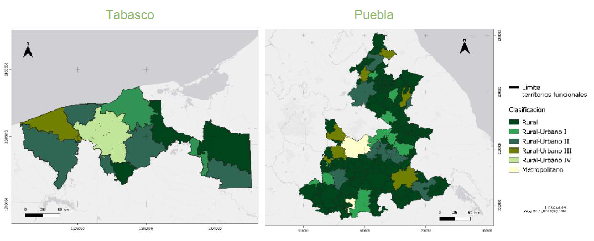
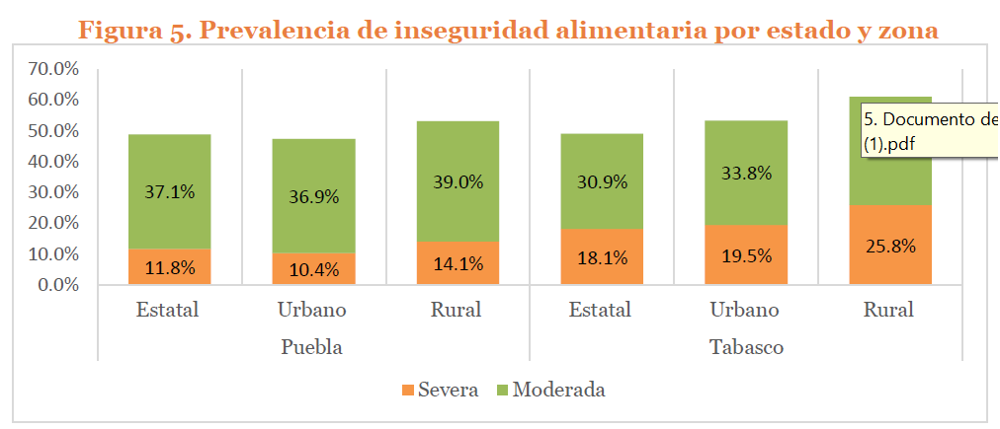
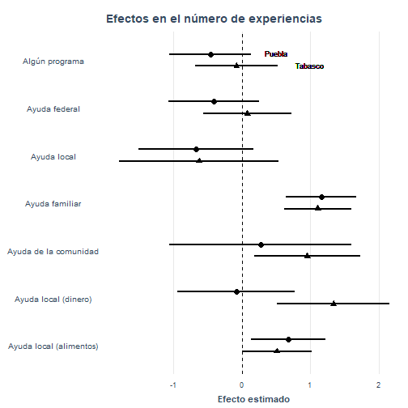
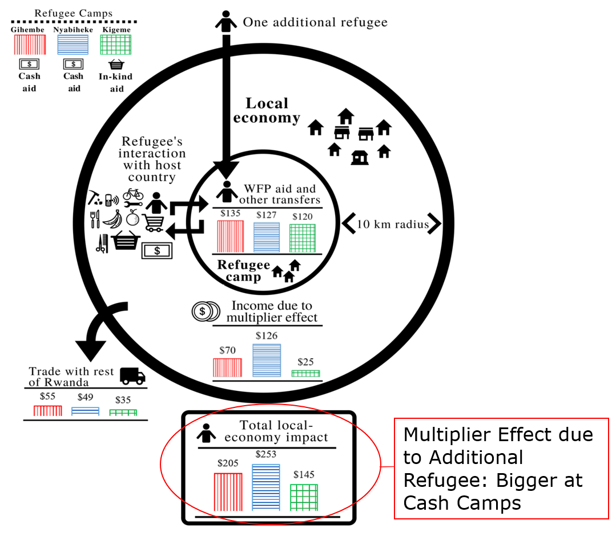

class: title-slide, inverse, center, middle

```{r setup, include=FALSE}
knitr::opts_chunk$set(echo = FALSE,
                      warning = F,
                      message = F,
                      fig.path = "figures/")

library(tidyverse)
library(sandwich)
library(estimatr) # regresión con errores robustos y agrupados
library(modelsummary) # para hacer tablas
library(ri2) # inferencia por aleatorización
```

```{css, echo = FALSE}
.huge .remark-code { /*Change made here*/
  font-size: 200% !important;
}
.tiny .remark-code { /*Change made here*/
  font-size: 60% !important;
}
```

.title[
# Medición de impactos de politicas públicas
]

<br/>

<br/>


.author[
### Irvin Rojas <br> [rojasirvin.com](https://www.rojasirvin.com/) <br> [<i class="fab fa-github"></i>](https://github.com/rojasirvin) [<i class="fab fa-twitter"></i>](https://twitter.com/RojasIrvin) [<i class="ai ai-google-scholar"></i>](https://scholar.google.com/citations?user=FUwdSTMAAAAJ&hl=en)
]

.affiliation[
#### Centro de Investigación y Docencia Económicas <br> División de Economía
]

<br/>

<br/>

_Medir en contextos complejos. Avances y desafíos metodológicos_

---

# Nuestra experiencia


- *Siembra desarrollo*

- Puebla y Tabasco en México (estados muy particulares)

- Primera parte:

  - Los efectos de la pandemia en la seguridad alimentaria


```{r out.height='10%'}

``` 


---

# Nuestra experiencia


```{r out.height='10%'}

``` 

---

# Nuestra experiencia

.center[
```{r out.width='500px'}

``` 

]

---

# ¿Qué aprendimos y qué estamos haciendo?

- Entendimos que el contexto ha cambiado

- Planteamos dos hipótesis de trabajo diractamente falseables

  - Sobre las dinámicas de consumo y producción
  - Sobre el papel de las políticas, programas y mecanismos de ayuda
  
- Coordinamos equipos de trabajo para diseñar instrumentos

  - Encuestas
  - Grupos focales
  - Historias de vida
  
- Planeamos análisis cuantitativos y cualitativos
  
  - Enfoque de investigación
  - Enfoque de incidencia


---

# Teorías causales

- Una de las razones por las que es complicado *medir* es porque no tenemos claro qué queremos medir

- Necesitamos buenas teorías que nos ayuden a establecer relaciones causales

- Nuestro trabajo debe estar tan planeado que antes de salir a campo ya debemos saber qué haremos con los datos

- La revolución de la credibilidad en la economía nos enseña que es mejor dar pequeños pasos, pero creíbles, en nuestro entendimiento de los fenómenos


---

# Diseño de los instrumentos

- Nuestros instrumentos deben de estar enfocados en medir exactamente lo que nos servirá para probar nuestras hipótesis

- Diversas consideraciones afectan el diseño de instrumentos:

  - Costo
  - Duración

- Los equipos deben consensuar qué información es prioritaria, cuál es secundaria y cuál es prescindible


- Debemos contar con procedimientos de control de calidad de los datos durante el levantamiento

- Debemos apegarnos a los estándares de replicabilidad y transparencia


---

# Análisis

.pull-left[

- Formar equipos con habilidades complementarias

- Técnicas sofisticadas no sustituyen buenas preguntas ni un buen diseño

- Usemos las técnicas que necesitamos

- Análisis complementarios

  - Modelos estructurales
  
  - Modelos de impactos en economías locales

- No perder de vista el objetivo de incidencia

]

.pull-right[
```{r out.height='10%'}

``` 
]

---

class: center, middle, inverse

# ¡Gracias!

.author[
### [rojasirvin.com](https://www.rojasirvin.com/)

### [irvin.rojas@cide.edu](mailto:irvin.rojas@cide.edu)

### <i class="fab fa-twitter"></i> [@rojasirvin](https://twitter.com/RojasIrvin)

]


